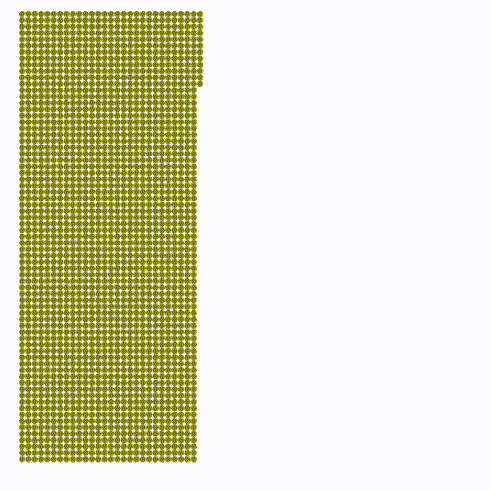

# mysph

_working title_

WIP interactive, GPU-accelerated fluid simulation using smoothed particle hydrodynamics.

runs almost entirely in WebGL2!

[try it!](https://loganzartman.github.io/mysph)

## controls

- `space`: start/stop simulation
- `s`: step forward in time (use while stopped)
- `r`: reset
- `click and drag`: touch fluid

secret url parameters:

- `?n=500`: set the number of particles
- `?cpu`: run the CPU/Canvas2D simulator (slower!)

## references

- [Smoothed Particle Hydrodynamics Techniques for the Physics Based Simulation of Fluids and Solids](https://interactivecomputergraphics.github.io/SPH-Tutorial/)
- [Smoothed Particle Hydrodynamics (Monaghan 1992)](https://www.researchgate.net/publication/230988821_Smoothed_Particle_Hydrodynamics)
- [Batcher's odd-even mergesort](https://en.wikipedia.org/wiki/Batcher_odd%E2%80%93even_mergesort)
  - this one is tough and hard to find recent writing about, but these resources helped a little:
  - [GPU Gems 2 ch 46: Improved GPU Sorting](https://developer.nvidia.com/gpugems/gpugems2/part-vi-simulation-and-numerical-algorithms/chapter-46-improved-gpu-sorting)
  - [odd-even mergesort network visualizer](http://bekbolatov.github.io/sorting/)
- neighbor search inspired by [Fast Fixed-radius Nearest Neighbors (Hoetzlein 2014)](https://on-demand.gputechconf.com/gtc/2014/presentations/S4117-fast-fixed-radius-nearest-neighbor-gpu.pdf)
  - a lot of detail is missing from the slides unfortunately
- [SPH Particle Collisions for the Reduction of Particle Clustering, Interface Stabilisation and Wall Modelling](https://www.scirp.org/journal/paperinformation.aspx?paperid=87356)
